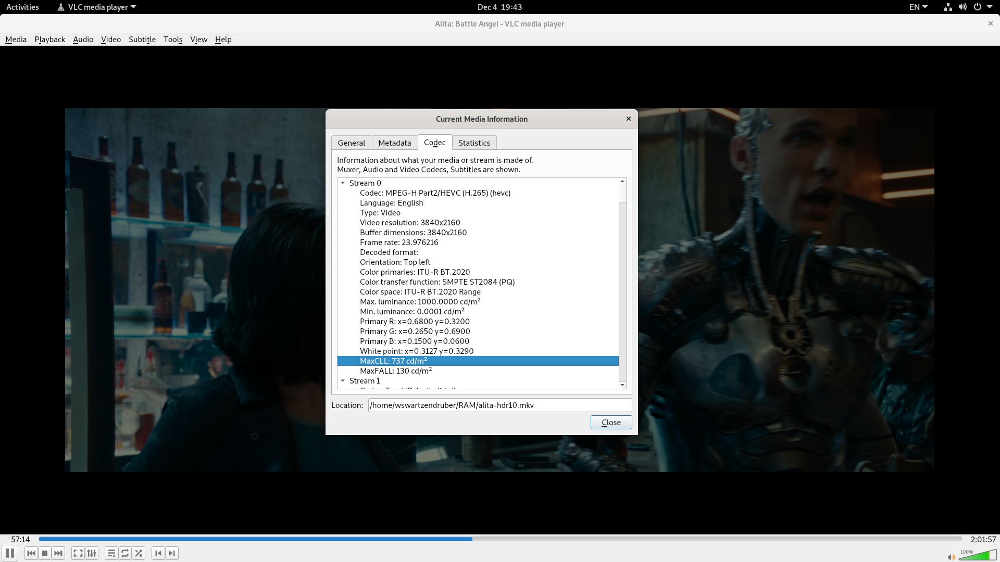
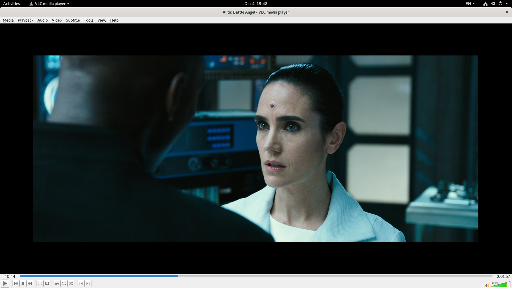
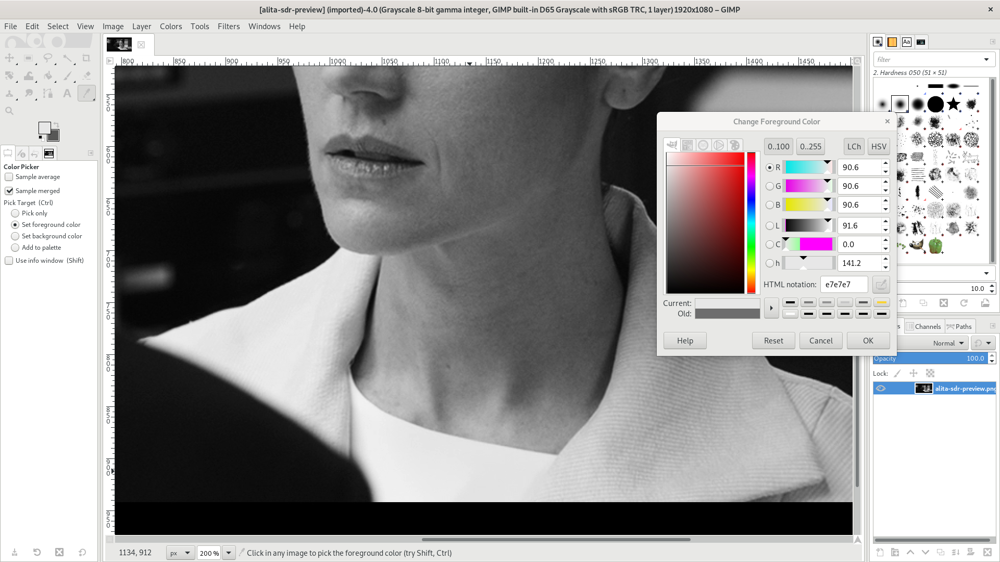
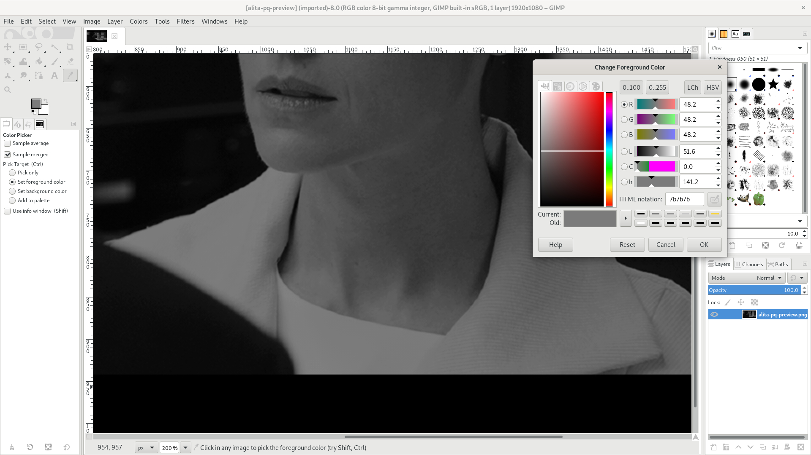

<!--
    SPDX-FileCopyrightText: 2021 William Swartzendruber <wswartzendruber@gmail.com>

    SPDX-License-Identifier: OSL-3.0
-->

# Introduction

The advent of 4K UltraHD discs has given consumers access to HDR10 content on a massive scale.
And while it's true that these discs possess the advantage of having considerably more dynamic
range than their blue-cased predecessors, they also have two main disadvantages:

1. They cannot be viewed on standard displays with any consistency.
2. The viewing environment must be tightly controlled to get an accurate picture.

HDR-HLG, on the other hand, offers viewers somewhat less dynamic range than HDR10, but also
offers them a compatible picture that can be viewed on both HDR and SDR displays. It also does
not place restrictions on the viewing environment.

The goal of this project is help users convert their 4K UltraHD discs into HDR-HLG. In this way,
they can retain most of the high dynamic range provided by HDR10 while also retaining compatible
viewing. This is particularly useful for individuals who want to have one rip that plays
anywhere.

What follows is a walkthrough of converting a HDR10 movie into HLG. The process of decrypting
physical media is not addressed.

# Walkthrough

For the purposes of this guide, we will be converting *Alita: Battle Angel* into HDR-HLG. We
will be working with both the HDR10 and SDR releases of the movie. The 4K packaging includes
both. Each mastering of the movie is assumed to exist in its own file:

* `alita-hdr10.mkv` (4K UltraHD)
* `alita-sdr.mkv` (standard Blu-ray)

Additionally, the following software tools will be needed:

* VLC
* The GIMP
* `ffmpeg`
* `pq2hlg` (from this project)
* `lcalc` (from this project)
* `sdrprev.sh` (from this project)
* `pqprev.sh` (from this project)

This guide will assume that the bottom three binaries and bottom two scripts are in `PATH`.

## Determine MaxCLL

The first thing we need to do is determine what the MaxCLL value is. Every 4K HDR disc should
have one. We're going to find this value by opening `alita-hdr10.mkv` in VLC and seeking to the
middle of the disc. We can pause here. Next, we'll click on **Tools** followed by **Codec
Information** to reveal the following window:



The MaxCLL value has been selected. If a disc does not contain this value, then **Max.
luminance** should be used as a substitute.

Remember this value.

## Determine Reference White

The next thing we need is the movie's reference white level. This is essentially how bright a
well-lit piece of white paper will appear in the picture. While this part can be rather annoying
to deal with, it is critical that it be done carefully. Otherwise, the resulting HLG image will
appear either too bright or too dark when viewed on a standard, non-HDR display. Unfortunately,
4K UltraHD discs are not even remotely consistent here while HDR-HLG is pretty strict about it.

Now we'll open the `alita-sdr.mkv` file in VLC. Again, we need a well-lit piece of white paper,
or, perhaps something similar. The frame at 40:44 has something interesting:



Chiren's white shirt that's under her lab coat isn't a piece of white paper, but it does reflect
a similar level of light. Remembering the 40:44 position, enter this command:

`sdrprev.sh alita-sdr.mkv 40:44 alita-sdr-preview.png`

That's going to generate a black and white image of that frame. Open it with The GIMP. Now our
goal is to find a pixel in that area with a brightness level of near 90%. At pixel (1134,912),
we can find just that:



Remember that pixel location.

Now enter this command:

`pqprev.sh alita-hdr10.mkv 40:44 alita-pq-preview.png`

Open the newly created file with The GIMP and take the brightness level of that same, exact
location:



It comes out to 48.2. With that value in hand, enter this command:

`lcalc 0.482`

Notice that we have simply taken the value given to us by The GIMP and divided it by 100. In our
case, `lcalc` returns:

`2.6386792184044956`

Remember this value as well.

## Generating the 3D LUT

Now we are ready to generate the 3D look-up table (LUT) that will define how to convert this
specific movie from HDR10 into HDR-HLG.

Do so with the following command:

`pq2hlg --size 128 --max-cll 737 --lum-scale 2.6386792184044956 pq2hlg.cube`

## Encoding the Video Stream

Now we encode the video stream. The important thing here is that the `pq2hlg.cube` file is
passed into the encoder as a 3D LUT. For this example, we'll be using x265 and cropping out the
black bars above and below the picture. We'll also be tagging the bitstream with the correct
color constants and transfer functions.

```
ffmpeg -i alita-hdr10.mkv -vf crop=3840:1600,scale=1920:800,format=rgb48le,lut3d=pq2hlg.cube,format=yuv420p10le \
    -color_primaries bt2020 -color_trc bt2020-10 -colorspace bt2020nc \
    -c:v libx265 -crf 20 -preset slower -tune grain -x265-params atc-sei=18:pic_struct=0 \
    video.h265
```

The generated video HLG video file will be called `video.h265`.

# Licensing

Different portions of this project are placed under different licenses:

| Component     | License                   | SPDX ID                           |
|---------------|---------------------------|-----------------------------------|
| Application   | Open Software License 3.0 | [`OSL-3.0`](LICENSES/OSL-3.0.txt) |
| Documentation | Open Software License 3.0 | [`OSL-3.0`](LICENSES/OSL-3.0.txt) |
| Build scripts | Public Domain             | [`CC0-1.0`](LICENSES/CC0-1.0.txt) |
| Unit tests    | Public Domain             | [`CC0-1.0`](LICENSES/CC0-1.0.txt) |

All screenshots of *Alita: Battle Angel* are copyrighted by 20th Century Fox with all rights
reserved. They are included here under fair use guidelines.
