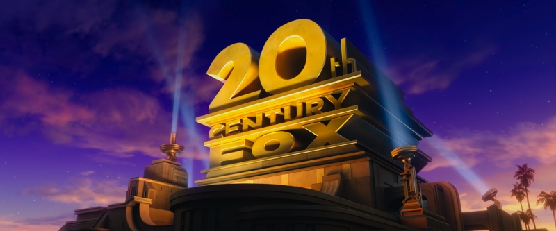
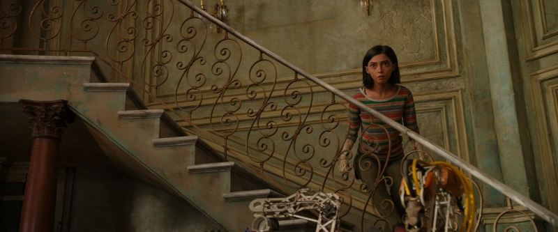
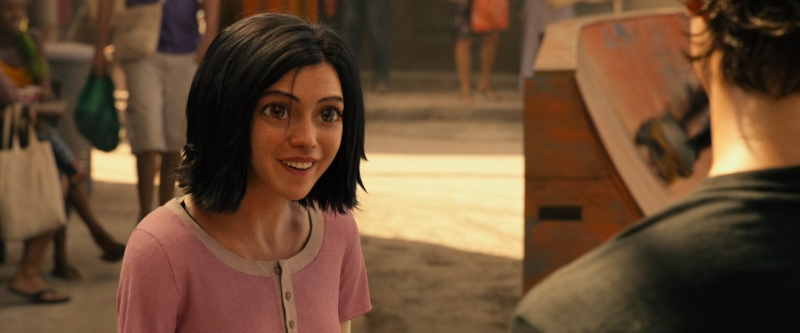
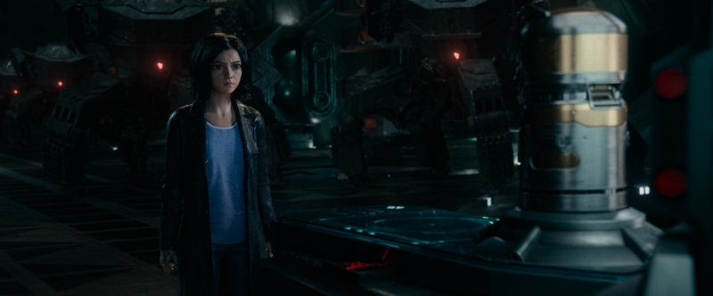
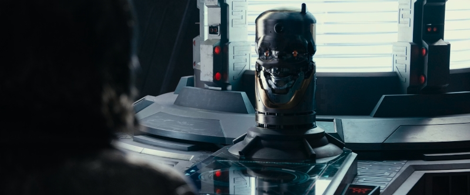
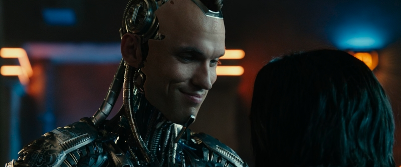
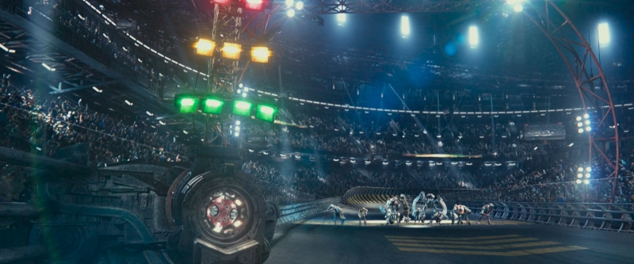
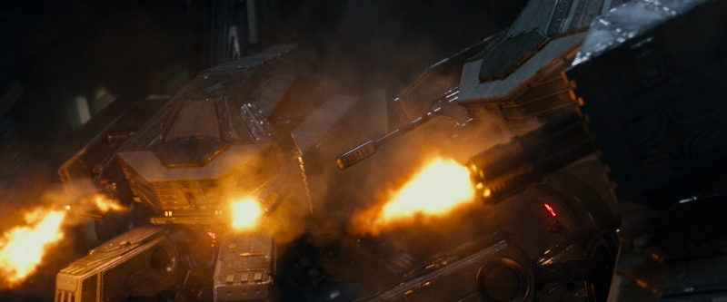
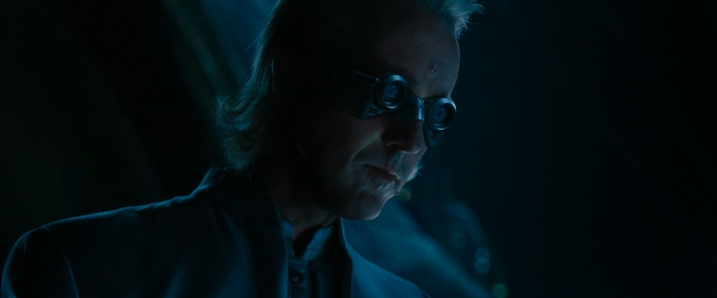

# Introduction

This tool suite consists of the basics needed to generate 3D LUTs that will convert video
streams from Perceptual Quantizer (PQ) HDR into Hybrid-Log Gamma (HLG) HDR. This is intended
to facilitate individuals in converting their physical HDR10 video libraries into HLG, thereby
allowing more universal viewing on devices including SDR displays.

Most of the work here is based on ITU-R BT.2390.

Note that nothing here addresses the topic of decrypting physical media.

# Rationale

## PQ Weaknesses

While it is true that PQ offers a rather large amount of dynamic range, the format has two main
weaknesses:

- PQ video streams **are** mastered for a specific viewing environment.
- PQ video streams **cannot** be reliably rendered on SDR displays with good results.

Regarding the first point above, PQ video streams are typically mastered for a viewing
environment of just 5 nits. Any increase in ambient lighting causes the displayed image to
appear darker than originally intended. This inherently limits what environments a PQ video can
be watched in. Another way to look at this is that the viewer is expected to accommodate what is
being shown.

Regarding the second point above, PQ is inherently difficult here because nothing about the
signal data indicates how SDR downconversion should be handled. This is necessary because
applying the PQ gamma curve without processing will produce a picture that is simply too dim.
Static HDR10 metadata cannot help us here, either, because what we really need for SDR
downconversion is the reference white level, but that is not signaled.

## HLG Strengths

In light of these two issues, the United Kingdom's BBC and Japan's NHK cooperated to create an
entirely new HDR format. This resulted in HLG which has two main strengths:

- HLG video streams **are not** mastered for a specific viewing environment.
- HLG video streams **can** be reliably rendered on SDR displays with good results.

Regarding the first point above, HLG video streams are mastered in relative brightness. This
means that instead of mastering the signal for a fixed viewing environment, HLG streams contain
more generic signal data that the display then alters according to its settings. Ergo, if the
viewing environment changes, the display can simply be adjusted and the same video can then be
viewed again with these new settings.

Regarding the second point above, HLG is inherently easy here because its gamma curve was
designed for it. That is, a HLG video signal can be naively displayed on a SDR device with more
acceptable results. However, since HLG *does* define a fixed reference white level, HLG-aware
players can modify the picture accordingly. The end result is that given the combination of a
correctly mastered (or converted) HLG stream and a HLG-aware player, it can be extremely
difficult to tell that the picture wasn't natively mastered for SDR. Some players are also good
at downconverting BT.2020 color to BT.709 color as a part of this process. MPV is one such
player.

# How It Works

The tooling here works to facilitate the following procedure:

- Gather color data on the PQ stream.
- Determine its reference white level.
- Adjust the brightness to bring reference white to 203 nits.
- Tone map the PQ stream to be within HLG's dynamic range.
- Apply the PQ-to-HLG conversion algorithm.

First, color data needs to be gathered on the PQ stream. The one and only thing we really care
about here is what the tooling refers to as `max-channel`. This is the highest ratio of linear
brightness between all three color channels. A value of `0.0` represents pitch black while a
value of `1.0` represents full brightness. Effectively, `max-channel` is the value of the
brightest pixel's highest color channel in linear space. The `pqstat` utility provides this
information.

Second, the reference white level needs to be determined. This is not as important if the HLG
output is going to be viewed on HDR displays only, but it is absolutely critical for SDR
compatibility. If `ref-white` is set too low, the SDR downconversion will appear too bright. If
`ref-white` is set too high, the SDR downconversion will appear too dim. This is the only part
of the process that requires human judgment and will be covered in detail below. This step is
unfortunately necessary because PQ content, especially from 4K UltraHD Blu-rays, tends to be
anywhere between 100 and 203 nits.

Third, the linear brightness of the PQ stream needs to be adjusted so that `ref-white` sits at
203 nits. The `max-channel` value is also going to be adjusted accordingly, even preserving
values higher than `1.0`. This step is handled by each 3D LUT that `pq2hlg` generates.

Fourth, each color channel will be tone mapped such that:

- All red subpixels fall within 262.7 nits.
- All green subpixels fall within 678 nits.
- All blue subpixels fall within 59.3 nits.

This will permit a pure white pixel to hit exactly 1,000 nits in accordance with BT.2390. This
step is also covered by the 3D LUT.

Fifth, the video signal finally gets converted from PQ to HLG. This is the last step convered by
the 3D LUT and the conclusion to the process.

# Procedure

## Prerequisites

So let's walk through converting a 4K UltraHD Blu-ray to HLG. For this scenario, we'll be using
`hlg-tools` along with `ffmpeg`. In particular, we'll be assuming that the following binaries
are in the PATH:

- `pqstat`
- `pq2hlg`
- `ffmpeg`

For using `pqstat`, raw piping will be required. On Windows, this rules out using most versions
of PowerShell in favor of the traditional Command Prompt.

We will also assume the presence of a disc dump in the form of a file called `source.mkv`. In
actuality, this is a MakeMKV dump of *Alita: Battle Angel*. We'll also be scaling down to
1920x800, which is this movie's native aspect ratio inside of a 1080p frame. This will allow
important detail to be preserved while also permitting playback on most current mobile devices.

## Determine `max-channel`

The first thing we're after is the movie's `max-channel` property. To get this, we're going to
have `ffmpeg` pipe raw RGB48LE into `pqstat`. Once the entire video has played back, `pqstat`
will output what we need.

```
ffmpeg -i source.mkv -f rawvideo -vf crop=3840:1600,scale=1920x800,format=rgb48le - | pqstat -w 1920 -h 800 -
```

This will cause the following to sent to be sent to STDOUT:

```
MaxCLL....: 988.9885283470023
MaxChannel: 0.09891422020140718
```

You can ignore MaxCLL here, but we absolutely need MaxChannel.

## Determine `ref-white`

The second thing we're after is the movie's `ref-white` property. The unfortunate truth of the
matter is that there is no straight forward way to handle this. Yet if it's not correctly
determined, the picture will appear either too bright or too dim when played back on SDR.

What we need to determine is how bright the current movie shows a fully diffused white surface.
One way to do this is to find a single frame where such an object is the brightest object in the
frame, and then have `ffmpeg` output only that frame to `pqstat`. In this case, the MaxChannel
result is ignored, and MaxCLL is taken as `ref-white`. Be sure to avoid frames that have either
direct light or light reflecting off a shiny surface.

From personal experimentation, I have used the following objects for determining `ref-white`:

- For *Alita: Battle Angel*, the opening text over solid black.
- For *The Avengers*, the opening "Marvel" text over solid red.
- For *Avengers: Age of Ultron*, Captain America's star while outdoors near the end.
- For *Man of Steel*, the specified ST.2084 standard of 100 nits.
- For *Iron Man* and *The Matrix*, the specified BT.2390 standard of 203 nits.

Since we're dealing with *Alita: Battle Angel* in this example, we'll take the MaxCLL of the
opening text. As this is text that fades in and out somewhat abruptly, we'll send in two full
seconds to make sure we get the text during its brightest point.

```
ffmpeg -ss 27 -i source.mkv -vframes 48 -f rawvideo -vf crop=3840:1600,scale=1920x800,format=rgb48le - | pqstat -w 1920 -h 800 -
```

This will produce (in addition to `ffmpeg`'s output):

```
MaxCLL....: 178.52157787560816
MaxChannel: 0.017852157787560816
```

And so our `ref-white` value becomes `178.52157787560816`.

## Generate the LUT

Now we're ready to generate the 3D LUT using the values we determined in the previous steps:

```
pq2hlg -m 0.09891422020140718 -r 178.52157787560816 -s 128 alita-battle-angel.cube
```

This will generate a 128x128x128 3D LUT that we can now pass into `ffmpeg` (or something else,
if we so desire).

## Perform the Conversion

Now let's invoke `ffmpeg` with our new LUT:

```
ffmpeg -i source.mkv -vf \
    crop=3840:1600,scale=1920:800,format=rgb48le,lut3d=alita-battle-angel.cube,format=yuv420p10le \
    -color_primaries 9 -color_trc 18 -colorspace 9 -color_range 1 \
    -c:v libx265 -crf 20 -preset slower -tune grain -x265-params \
    colorprim=bt2020:transfer=arib-std-b67:colormatrix=bt2020nc:range=limited \
    video.h265
```

Note that this example handles only the video and not any other assets such as audio or
subtitles.

## The End Result

While the resulting HLG output is genuine HDR, we can also measure its usefulness by how it
appears when played back on a SDR display. I have gathered some screenshots from the above
example:



















